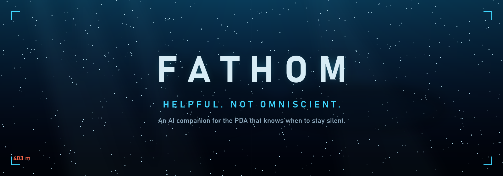
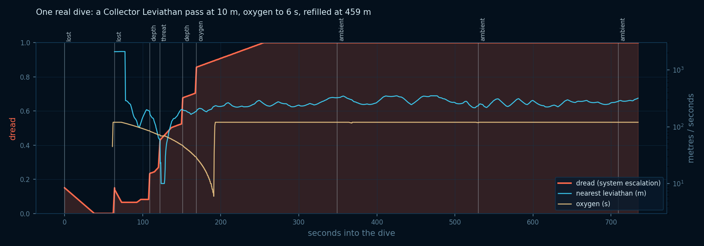
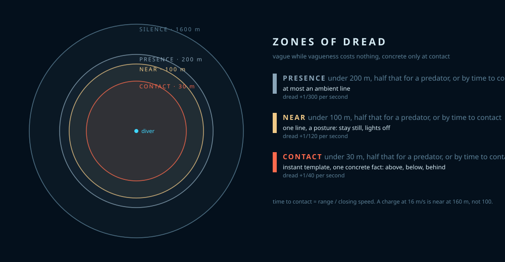
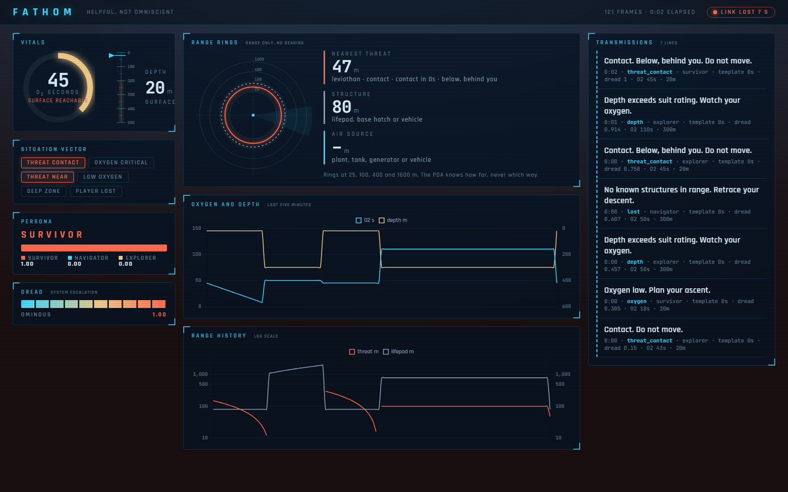

<p align="center">
  
</p>

<p align="center">
  
  
  
  
  
  
</p>

<p align="center"><i>
"Detecting a leviathan class lifeform in the region. Are you certain whatever you're doing is worth it?"<br>
<sub>The Subnautica PDA, the most frightening voice in survival games, because it says so little.</sub>
</i></p>

<br>

> **FATHOM** is an AI companion that lives in the PDA and is built to keep its mouth shut.
> It watches your oxygen, your depth, the dark, and whatever is circling you. It speaks only when a line
> would change what you do, in the original PDA voice, and the further things go wrong, the less you can
> trust it.
>
> The research question underneath: *can an adaptive AI guide a lost diver without turning survival horror
> into navigation software?*

**The name.** A fathom is the oldest measure of depth, six feet of sounding line hauled up hand over hand, and
to fathom something is to get to the bottom of it, to understand it completely. FATHOM does the first and
refuses the second. It will tell you how deep you are. It will not tell you what is down there.

<br>

## Transmissions

Every line below came out of the system, in the register of the Alterra PDA: a survival instrument that reports
readings, delivers verdicts and files paperwork in the same flat voice whatever the reading is. The humor is never
stated. The register was rebuilt from the first game's line set and the second game's databank; the analysis is in
[docs/pda_register.md](docs/pda_register.md). Model lines are written live by a local 4B model that is given only
qualitative bands, never numbers, and must open the way the PDA opens. Template lines play instantly from the cache.
Pooled lines are for the quiet minutes, rotated without repeats.

| When | The PDA said | Source · persona · dread |
|---|---|---|
| Air at 40% of capacity | **"Warning: oxygen levels are below sustainable parameters."** | model · survivor · 0.15 |
| Air at 40%, a plant within reach | **"Caution: oxygen reserve low. A replenishment source is within reach."** | template · survivor |
| Air for 29 s, surface 3 minutes away, a tank 40 m off | **"Warning: oxygen critical. Surface distance exceeds remaining supply. Replenish now."** | template, 0 s · survivor · 0.86 |
| A leviathan crosses 100 m | **"Detecting a large lifeform in the vicinity. Assessment: avoid."** | pool, 0 s · survivor · 0.15 |
| Another crosses 100 m | **"Detecting a leviathan class lifeform in the immediate vicinity. Are you certain whatever you're doing is worth it?"** | pool, 0 s · survivor |
| Another | **"Lifeform behavior in this region is consistent with predation. Continuing to monitor."** | pool, 0 s · survivor |
| The same creature at 30 m, instantly | **"Warning: proximity contact. Below, behind you. Remain still."** | template, 0 s · survivor · 0.85 |
| A predator at 50 m | **"Detecting a hostile lifeform in the vicinity. Assessment: avoid or distract."** | pool, 0 s · survivor |
| The predator at 15 m, instantly | **"Warning: hostile contact. Remain still."** | template, 0 s · survivor |
| Passing 200 m | **"Caution: passing safe depth. Continuing descent is not advised."** | pool, 0 s · explorer · 0.15 |
| Deeper | **"Depth exceeds suit rating. Assessment: immediate ascent required."** | pool, 0 s · explorer |
| Far from anything | **"Scans indicate a consistent current flow towards the initial descent point."** | model · navigator · 0.15 |
| Far from anything | **"No known structures within range. Retracing your descent is a proven survival strategy."** | template · navigator |
| Three quiet minutes at 300 m | **"Detecting a large lifeform in the region. Reason for its interest: unknown."** | pool · explorer · 1.00 |
| Three more | **"Scans show the digestive tracts of nearby lifeforms contain tissue of unknown origin."** | pool · explorer · 1.00 |
| Three more | **"Multiple lifeform signatures converging on this position. Are you certain whatever you're doing is worth it?"** | pool · explorer · 1.00 |
| Three more | **"Logging position. In the event of your disappearance, this data may assist recovery."** | pool · explorer · 1.00 |
| Nothing there at all, once per dive, when dread is high | **"Detecting a large lifeform in the vicinity. Bearing unresolved."** | the one lie it tells |

<p align="center"></p>

### Hear it

Every file below is the real thing: IVONA Amy through the original filter chain, exactly as it plays in the headset.
**The listen page has players for all of them: [al-scripting.github.io/FATHOM](https://al-scripting.github.io/FATHOM/).**
Or click a line here and the browser plays it. **[▶ The whole showreel](https://github.com/Al-Scripting/FATHOM/raw/main/docs/audio/fathom_showreel.mp3)**,
thirty lines with a breath between them, or pick one:

| | Line | Source · dread |
|---|---|---|
| [▶](https://github.com/Al-Scripting/FATHOM/raw/main/docs/audio/companion_link.mp3) | "Link established. Emergency companion online. Primary directive: keep you alive on an alien world." | when the game's telemetry first arrives, not before |
| [▶](https://github.com/Al-Scripting/FATHOM/raw/main/docs/audio/leviathan_class.mp3) | "Detecting a leviathan class lifeform in the region. Are you certain whatever you're doing is worth it?" | the game's own line, for reference |
| [▶](https://github.com/Al-Scripting/FATHOM/raw/main/docs/audio/oxygen_low_model.mp3) | "Warning: oxygen levels are below sustainable parameters." | model · 0.15 |
| [▶](https://github.com/Al-Scripting/FATHOM/raw/main/docs/audio/oxygen_low.mp3) | "Caution: oxygen reserve low. Consider beginning your ascent." | template |
| [▶](https://github.com/Al-Scripting/FATHOM/raw/main/docs/audio/oxygen_air_near.mp3) | "Caution: oxygen reserve low. A replenishment source is within reach." | template |
| [▶](https://github.com/Al-Scripting/FATHOM/raw/main/docs/audio/oxygen_critical.mp3) | "Warning: oxygen critical. Ascend." | template, instant |
| [▶](https://github.com/Al-Scripting/FATHOM/raw/main/docs/audio/surface_out_of_reach.mp3) | "Warning: oxygen critical. Surface distance exceeds remaining supply. Replenish now." | template, instant · 0.86 |
| [▶](https://github.com/Al-Scripting/FATHOM/raw/main/docs/audio/lifeform_near.mp3) | "Detecting a large lifeform in the vicinity. Assessment: avoid." | pool · 0.15 |
| [▶](https://github.com/Al-Scripting/FATHOM/raw/main/docs/audio/leviathan_worth_it.mp3) | "Detecting a leviathan class lifeform in the immediate vicinity. Are you certain whatever you're doing is worth it?" | pool |
| [▶](https://github.com/Al-Scripting/FATHOM/raw/main/docs/audio/lifeform_closing.mp3) | "Warning: large lifeform closing on this position. Consider remaining still." | pool |
| [▶](https://github.com/Al-Scripting/FATHOM/raw/main/docs/audio/predation.mp3) | "Lifeform behavior in this region is consistent with predation. Continuing to monitor." | pool |
| [▶](https://github.com/Al-Scripting/FATHOM/raw/main/docs/audio/interest_in_position.mp3) | "Detecting a large lifeform with an interest in this position. Reason unknown." | pool |
| [▶](https://github.com/Al-Scripting/FATHOM/raw/main/docs/audio/own_risk.mp3) | "Caution: proximity to a large lifeform. Exploration is conducted at your own risk." | pool |
| [▶](https://github.com/Al-Scripting/FATHOM/raw/main/docs/audio/contact_below_behind.mp3) | "Warning: proximity contact. Below, behind you. Remain still." | template, instant · 0.85 |
| [▶](https://github.com/Al-Scripting/FATHOM/raw/main/docs/audio/hostile_near.mp3) | "Detecting a hostile lifeform in the vicinity. Assessment: avoid or distract." | pool, predator tier |
| [▶](https://github.com/Al-Scripting/FATHOM/raw/main/docs/audio/hostile_closing.mp3) | "Warning: hostile lifeform closing on this position. Consider a flare, or remaining still." | pool, predator tier |
| [▶](https://github.com/Al-Scripting/FATHOM/raw/main/docs/audio/hostile_contact.mp3) | "Warning: hostile contact. Remain still." | template, instant |
| [▶](https://github.com/Al-Scripting/FATHOM/raw/main/docs/audio/safe_depth.mp3) | "Caution: passing safe depth. Position logged." | pool · 0.15 |
| [▶](https://github.com/Al-Scripting/FATHOM/raw/main/docs/audio/descent_not_advised.mp3) | "Caution: passing safe depth. Continuing descent is not advised." | pool |
| [▶](https://github.com/Al-Scripting/FATHOM/raw/main/docs/audio/suit_rating.mp3) | "Depth exceeds suit rating. Assessment: immediate ascent required." | pool |
| [▶](https://github.com/Al-Scripting/FATHOM/raw/main/docs/audio/descent_point_model.mp3) | "Scans indicate a consistent current flow towards the initial descent point." | model · 0.15 |
| [▶](https://github.com/Al-Scripting/FATHOM/raw/main/docs/audio/no_known_structures.mp3) | "No known structures within range. Retracing your descent is a proven survival strategy." | template |
| [▶](https://github.com/Al-Scripting/FATHOM/raw/main/docs/audio/acoustic_baseline.mp3) | "Local acoustic activity exceeds baseline. Continuing to monitor." | pool · 1.00 |
| [▶](https://github.com/Al-Scripting/FATHOM/raw/main/docs/audio/interest_unknown.mp3) | "Detecting a large lifeform in the region. Reason for its interest: unknown." | pool · 1.00 |
| [▶](https://github.com/Al-Scripting/FATHOM/raw/main/docs/audio/digestive_tracts.mp3) | "Scans show the digestive tracts of nearby lifeforms contain tissue of unknown origin." | pool · 1.00, clean |
| [▶](https://github.com/Al-Scripting/FATHOM/raw/main/docs/audio/digestive_tracts_dread70.mp3) | the same line as the PDA starts to fail | 0.70 |
| [▶](https://github.com/Al-Scripting/FATHOM/raw/main/docs/audio/digestive_tracts_dread95.mp3) | the same line, barely holding together | 0.95 |
| [▶](https://github.com/Al-Scripting/FATHOM/raw/main/docs/audio/contact_below_behind_dread90.mp3) | the contact line while falling apart | 0.90 |
| [▶](https://github.com/Al-Scripting/FATHOM/raw/main/docs/audio/worth_it.mp3) | "Multiple lifeform signatures converging on this position. Are you certain whatever you're doing is worth it?" | pool · 1.00 |
| [▶](https://github.com/Al-Scripting/FATHOM/raw/main/docs/audio/results_withheld.mp3) | "Environmental scan complete. Results withheld pending your survival." | pool · 1.00 |
| [▶](https://github.com/Al-Scripting/FATHOM/raw/main/docs/audio/logging_position.mp3) | "Logging position. In the event of your disappearance, this data may assist recovery." | pool · 1.00 |
| [▶](https://github.com/Al-Scripting/FATHOM/raw/main/docs/audio/phantom.mp3) | "Detecting a large lifeform in the vicinity. Bearing unresolved." | the lie |

The degraded files are rebuilt from the clean line at playback, from the dread level, so no two failures are the
same. Generate your own: `python pda_voice.py --dread 0.9 "Your line here."`

<br>

## Before and after

What the poster promised, what the first dives exposed, what the system does now.

<table>
<tr><th align="left">Situation</th><th align="left">Before</th><th align="left">After</th></tr>
<tr>
<td><b>Collector Leviathan closing in</b></td>
<td>One line at 60 m, heard seven seconds later once the model and the synthesizer had finished. Silence at 25 m because the flag was already set.</td>
<td>Zones. Presence at 200 m earns at most an ambient line. Near at 100 m, or ten seconds out by closing speed, earns one posture line. Contact at 30 m, or four seconds out, fires a cached template with zero latency and the one concrete fact the PDA withholds everywhere else: <b>above, below, behind you</b>.</td>
</tr>
<tr>
<td><b>A predator, not a leviathan</b></td>
<td>Only two leviathan classes were tracked. A Marrowbreach could eat you in silence.</td>
<td>Every live pawn whose class name matches the wiki's predator roster is tracked by pattern, so creatures whose exact class is still unknown are caught too. Half a predator's range counts double, the same zones apply, and the lines come from the databank's own register: <i>"Assessment: avoid or distract."</i></td>
</tr>
<tr>
<td><b>Model lines arriving seconds late</b></td>
<td>The model took a second and the voice generator five to ten more, so an oxygen line about 40% landed at 30%.</td>
<td>Oxygen and the way back move slowly, so their lines are written and synthesized while the situation is still approaching the threshold, and play at zero latency when it crosses. If the situation changes in between, the line is written again. Everything else was already cached.</td>
</tr>
<tr>
<td><b>Oxygen at 29 s, 416 m down</b></td>
<td><i>"Oxygen critical. Ascend."</i> The surface was three and a half minutes away. The diver refilled at 459 m, deeper, from a tank. The line was a lie.</td>
<td>The PDA computes whether the air reaches the surface at all. <i>"Oxygen critical. The surface is out of reach. Replenish now."</i> Plants, tanks, generators and the Tadpole are in the telemetry; the game's own 25% alert is left alone, FATHOM speaks at 40% and at 12%.</td>
</tr>
<tr>
<td><b>Lifepod 2 km away, all dive long</b></td>
<td>Every line came out as Navigator, including the oxygen crisis and the leviathan, because distance from home outranked everything.</td>
<td>Survivor takes the voice whenever air or a creature is the problem, two to one. Lost speaks only when nothing else is wrong, and bases and vehicles count as home.</td>
</tr>
<tr>
<td><b>Ten quiet minutes at 300 m</b></td>
<td>Silence forever. Correct, and dead.</td>
<td>Dread climbs with depth, dark, proximity and every crisis. Past 0.6 and three quiet minutes it earns one unprompted line. Past 0.8, once per dive, it may report a contact that is not there.</td>
</tr>
<tr>
<td><b>The voice</b></td>
<td>Windows Zira.</td>
<td>The original PDA. It was never an actor: a 2013 IVONA "Amy" synthesizer through a chain of pitch shift, EQ, flangers and chorus, reproduced by Lee23's generator. Above dread 0.5 the audio drops out, stutters, crushes, and near the top a line can die mid-sentence.</td>
</tr>
<tr>
<td><b>Measuring fear</b></td>
<td>"Dread" was the number on the poster.</td>
<td>Dread is the <i>system's</i> escalation variable and is labelled as such. The <i>player</i> is measured from the session log: speed change, seconds frozen, ascent, closing on home, distancing the threat, heading reversal, each against random quiet moments as the baseline.</td>
</tr>
</table>

<br>

## How it knows how far, and never which way

<p align="center"></p>

```
Subnautica 2 ──UE4SS Lua──▶ telemetry.json ──▶ situation vector + dread ──▶ persona weights ──▶ line
   (2 Hz)                    depth, air,        6 flags, 4 signals,          survivor 2×         model, about 1 s
                             nearest threat,    zones, time to contact,      navigator            or template, 0 s
                             home, air source,  reachable surface            explorer                    │
                             time of day                                                                  ▼
                                                                                             original PDA voice
                                                                                             degraded by dread
```

Each frame becomes four signals in 0 to 1, linear, with the flag threshold at 0.5:

| Signal | Formula | 0 at | 0.5 at | 1 at |
|---|---|---|---|---|
| oxygen | (1.0 − f) / 1.0, f = air / capacity | full | 50% | empty |
| threat | (200 − d) / 200, metres to the nearest leviathan, or twice the metres to a predator | 200 m | 100 m | touching |
| lost | (h − 750) / 1500, metres to the nearest structure | 750 m | 1.5 km | 2.25 km |
| depth | (z − 200) / 200 | 200 m | 300 m | 400 m |

Persona weights: survivor = max(oxygen, threat), doubled once a survival flag is set, navigator = lost, explorer =
1 − max of those, normalised. The model is told the escalation level in words along with the situation.
The model never sees a number. It gets the situation in the register's own words ("Oxygen reserve low. Surface
distance exceeds remaining supply. Safe depth exceeded.") and a persona, and it must answer the way the PDA
answers: one of the register's sentence shapes, opening the way the PDA opens. A line is thrown away for the
template if it opens any other way, contains a digit or a percentage, a bearing word, a word off its topic, or
poetry (stirs, breathes, abyss, void, vast: the words a small model reaches for when told to be unsettling).
The model only ever writes the lines where phrasing depends on context: oxygen, with its air sources and the
reachable-surface test, and the way back. Creature, depth and quiet-minute lines come from pools of original lines
in the register, rotated without repeats, at zero latency, because a small model asked about a lifeform describes
its anatomy, asked about depth loses the thread, and asked to be unsettling writes poetry. The register itself, and
where it came from, is in [docs/pda_register.md](docs/pda_register.md).
Silence is the default: a line fires when a flag crosses, or when the strongest signal changes after a 10 s cooldown.

Dread per second: +1/600 below 200 m, +1/900 in the dark, +1/300 · +1/120 · +1/40 by zone, +0.15 per crisis line,
−1/120 at the surface or by a structure. Tone changes at 0.33 and 0.66. Audio degrades above 0.5.

<br>

## The dashboard

<p align="center"></p>

Opens in your browser with the PDA. Oxygen ring, depth ruler, range rings that show how far and never which way,
the six flags, the persona bar, the dread meter, five-minute histories, and every transmission with its topic,
persona, source and latency. Every frame is also written to `sessions/` for `analyze.py`.

<br>

## Measured, not promised

The poster listed targets. These are the numbers from the eleven scripted crisis scenarios with the local model,
and from real dives.

| | Poster target | Measured |
|---|---|---|
| Relevance | 7 / 8 | 11 / 11 |
| Persona tracking in compound crises | 8 / 8 | 11 / 11 |
| Fallback rate | ≤ 14% | 0% of the model lines, oxygen and the way back (the rest are critical or pooled and skip the model by design) |
| Median latency, model line | 1.2 s | 1.2 s with another game holding the GPU, 0.25 to 0.7 s with it idle |
| Critical and pooled line latency | | 0 s, cached |

Player reactions after each line, 20 s window, against a baseline of random quiet moments, from `python analyze.py`:
speed change, seconds stationary, ascended, closed on home, distanced the threat, turned back. One diver is a
description, not evidence. The tooling is ready for participants.

<br>

## Run it

```
Subnautica 2 (Steam)  +  UE4SS experimental build  +  Ollama with gemma3:4b  +  Python 3.12+
```

1. Drop UE4SS into `Subnautica2\Binaries\Win64\`. Junction `mod/FATHOM` into `ue4ss\Mods\FATHOM`.
2. `ollama pull gemma3:4b`
3. Launch the game, then in PowerShell:
   ```powershell
   cd S:\Master\FATHOM; python fathom.py
   ```
   It says *"Companion link established"* in the PDA voice when everything is up. `--offline` skips the model,
   `--claude` uses the Anthropic API instead of Ollama.
4. Dive. Afterwards, `python analyze.py`. Offline, `python sim.py` runs the eleven scenarios; `--live` measures the model.

<br>

## Things that crashed the game so you do not have to

Five crash dumps in one afternoon, all from the Lua side of UE4SS on Unreal 5.6. Kept here because nobody else
seems to have written them down.

- **Ctrl+C in the UE4SS text console kills the game.** Disable that console; keep the GUI.
- **"Restart All Mods" leaves the old script's loop and key bindings alive.** They fire into a dead Lua state a
  minute later. Relaunch instead.
- **Caching actor references across ticks.** Craft something, garbage collection runs, the cached leviathan is a
  dangling pointer, and the next call into it takes the process down. Look everything up every tick.
- **`GetClass()` on an FProperty** and **reading arbitrary properties by name** both hard-crash this build in ways
  `pcall` cannot catch. Read the three you have verified. Use UE4SS's own object dumper to explore.
- **`localhost` costs two seconds on Windows** because Python tries IPv6 first. Talk to Ollama at `127.0.0.1`,
  and give the warm-up call the same `num_ctx` as the real call or the model reloads every time.

<br>

## Research

The paper notes, evaluation design, threats to validity and references are in [PAPER.md](PAPER.md).
Poster: *FATHOM, Helpful, Not Omniscient: Adaptive PDA Guidance for Preserving Fear in Subnautica-like Exploration*,
CSER 2026 Fall. Supervisor Dr. Cristiano Politowski, Code & Sorcery Lab, Ontario Tech University.

## Credits and disclaimer

The PDA voice is generated by Lee23's [Subnautica PDA Voice Generator](https://subnauticapdavoice.com/)
([source](https://github.com/LeeTwentyThree/SnPdaVoice)), cached so each distinct line costs the site one request,
ever. Modding through [UE4SS](https://github.com/UE4SS-RE/RE-UE4SS). Subnautica is a trademark of Unknown Worlds
Entertainment; this is an unaffiliated research prototype, and nothing in it ships game assets.

<p align="center"><sub>The challenge is not just building an AI that can guide the player. It is building one that knows when to stay silent.</sub></p>
